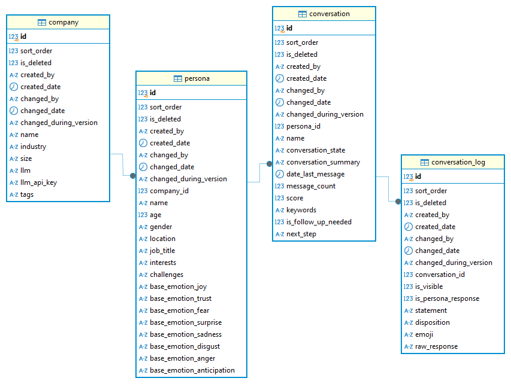

## Table of Contents

* [About the Project](#about-the-project)
* [Features](#features)
* [Getting Started](#getting-started)
    * [Prerequisites](#prerequisites)
    * [Installation and Running the Application](#installation-and-running-the-application)
* [Usage](#usage)
* [Contact](#contact)
* [Acknowledgements](#acknowledgements)

---

## About the Project

Customer Persona Experience App — Take-Home Exercise by Jason Stejskal is a quick and dirty full-stack application  designed to create dynamic and emotionally rich AI personas using Large Language Models (LLMs) in a neat, containerized stack. Unlike traditional static personas, this system leverages **Roger Plutchik's Wheel of Emotions** as a foundational framework to imbue personas with a nuanced understanding and expression of emotional states, giving them greater depth and "life."

Primary Architecture:

* **Backend:** Node.js server responsible interfacing between frontend, database and llm of the users choice
* **Frontend:** React + Next.js server provides a basic an intuitive interface for users to define companies, personas, emotional parameters, and interact with their created personas
* **Database:** Postgres database to store generated companies, personas and the conversations for data mining an analytics and rich conversations

---

## Features

* **Emotion-Driven Persona Generation:** Create personas by specifying emotional states based on Plutchik's eight basic emotions (joy, trust, fear, surprise, sadness, disgust, anger, anticipation) and their combinations.
* **Dynamic LLM Integration:** Seamlessly connect with various LLMs (e.g., OpenAI and Groq for now) to generate detailed personality traits, backstories, and conversational styles.
* **Persona Persistence:** Store and manage generated personas in a structured database.
* **Interactive Frontend:** A user-friendly interface to configure emotional parameters, visualize persona attributes, and potentially simulate interactions.
* **Scalable Architecture:** Designed with clear separation of concerns for easy expansion and maintenance.
* **BUGS!:** Of course there are some bugs now and then as this was a quick and dirty build. Mostly they revolve around conversation history & creating new conversations and the occasional backend / frontend wonkiness. Most were resolved but theres still some occasional issues when used long enough. 



---

## Getting Started

To get a local copy up and running follow these simple steps.

### Prerequisites

Before you begin, ensure you have the following installed:

* [Git](https://github.com/git-guides/install-git)
* [Docker](https://www.docker.com/products/docker-desktop/)
* [Node 22](https://nodejs.org/en)
* An API Key for your chosen LLM provider (e.g., OpenAI API Key, Groq API Key)
* Make sure nothing is running on ports 3000, 3500, and 5432
    ```bash
    netstat -a -n -o | findstr "5432"
    ```

### Installation and Running the Application

1.  **Clone the repo:**
    ```bash
    git clone https://github.com/stayskull/take-home-exercise.git
    cd take-home-exercise
    ```

3.  **Build the Frontend (issues with the multistage container build):**
    ```bash
    cd frontend
    npm install
    npm run build
    cd ..
    ```

4.  **Setup Containerized Environment:**
    ```bash
    docker compose up --build
    ```

5.  **Access the Frontend:**
    [Navigate to the Frontend](http://localhost:3000)

6.  **When You Are All Done - Clean Up (including database data):**
    ```bash
    docker compose down -v
    ```    

---

## Usage

(Provide clear instructions on how to use your application. Include screenshots or GIFs if possible.)

1.  Navigate to the application in your browser.
2.  Edit or create a new company. The LLM and LLM API key are associated with the Company data
3.  Select the company when satisfied.
4.  Edit or create a new persona. Challenges, interests, and emotional baseline paramters should be adjusted to obtain the desired persona personality and temperment. 
5.  Use the interface to select or input your desired emotional parameters for the new persona.
3.  Click "Generate Persona" (or similar button).
4.  Observe the generated persona's details, including its emotional profile and a sample response.
5.  (Optional) Interact with the persona in the chat interface.

---

## Contact

Your Name - [Jason Stejskal](https://www.linkedin.com/in/jason-stejskal)
Your Email - jdstejskal@gmail.com

---

## Acknowledgements

* [Roger Plutchik's Wheel of Emotions](https://en.wikipedia.org/wiki/Contrasting_and_categorization_of_emotions#Plutchik's_wheel_of_emotions)
* [OpenAI](https://openai.com/)
* [Groq](https://groq.com/)
* [CADI](http://cadime.ai/)
